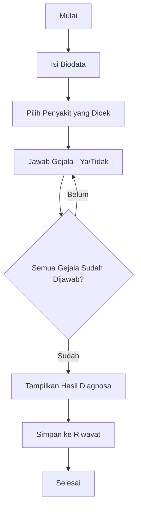

# 🩺 Sistem Pakar Diagnosa Gangguan Tidur

Aplikasi sistem pakar berbasis web untuk mendiagnosa gangguan tidur menggunakan metode forward chaining. Dibangun dengan **FastAPI** dan **MySQL**.

## 📋 Daftar Isi

- [Fitur](#-fitur)
- [Teknologi](#-teknologi)
- [Quick Start dengan Docker](#-quick-start-dengan-docker)
- [Setup Manual (Development)](#-setup-manual-development)
- [Struktur Database](#-struktur-database)
- [Alur Diagnosa](#-alur-diagnosa)
- [API Documentation](#-api-documentation)
- [Environment Variables](#-environment-variables)

## ✨ Fitur

- 🔍 Diagnosa gangguan tidur dengan metode forward chaining
- 📝 Input biodata pasien
- ❓ Tanya jawab gejala (Ya/Tidak)
- 📊 Hasil diagnosa lengkap dengan pengertian, penyebab, dan solusi
- 📚 Riwayat diagnosa tersimpan
- 🔐 Panel admin untuk mengelola data

## 🛠 Teknologi

- **Backend:** FastAPI (Python 3.12)
- **Database:** MySQL 8.0
- **Package Manager:** [uv](https://docs.astral.sh/uv/) (fast Python package manager)
- **Frontend:** HTML, CSS, JavaScript (vanilla)
- **Container:** Docker & Docker Compose

---

## 🐳 Quick Start dengan Docker

Cara tercepat untuk menjalankan aplikasi:

```bash
# Clone repository
git clone <repository-url>
cd Sistem-Pakar

# Copy environment file
cp .env.example .env

# Jalankan dengan Docker Compose
docker compose up -d

# Cek status container
docker compose ps
```

Akses aplikasi:
- 🌐 **Website:** http://localhost:8000
- 📚 **API Docs:** http://localhost:8000/docs
- 🔧 **ReDoc:** http://localhost:8000/redoc

### Docker Commands

```bash
# Start (build ulang jika ada perubahan)
docker compose up -d --build

# Stop
docker compose down

# Lihat logs
docker compose logs -f app

# Restart app saja
docker compose restart app

# Hapus semua (termasuk database volume)
docker compose down -v
```

---

## 💻 Setup Manual (Development)

### Prerequisites

- Python 3.12+
- MySQL (via Laragon, XAMPP, atau lainnya)
- [uv](https://docs.astral.sh/uv/) package manager

### 1. Setup Database

1. Jalankan MySQL server
2. Buat database: `sistem_pakar_tidur`
3. Import `db_init.sql` via phpMyAdmin atau HeidiSQL

```bash
mysql -u root -p sistem_pakar_tidur < db_init.sql
```

### 2. Setup Python Environment dengan uv

```bash
# Install uv (jika belum ada)
curl -LsSf https://astral.sh/uv/install.sh | sh

# Atau dengan pip
pip install uv

# Sync dependencies
uv sync

# Copy environment file
cp .env.example .env
# Edit .env sesuai konfigurasi MySQL kamu
```

### 3. Jalankan Server

```bash
# Menggunakan uv run
uv run uvicorn app.main:app --reload --host 127.0.0.1 --port 8000

# Atau aktifkan venv dulu
source .venv/bin/activate  # Linux/Mac
# .venv\Scripts\activate   # Windows
uvicorn app.main:app --reload --host 127.0.0.1 --port 8000
```

---

## 🗄 Struktur Database

| Tabel | Deskripsi |
|-------|-----------|
| `penyakit` | Data penyakit/gangguan tidur |
| `gejala` | Daftar gejala yang mungkin dialami |
| `aturan` | Relasi antara penyakit dan gejala |
| `solusi` | Solusi untuk setiap penyakit (kode S01, S02, ...) |
| `sesi_diagnosa` | Sesi diagnosa aktif |
| `jawaban_diagnosa` | Jawaban user per sesi |
| `riwayat_diagnosa` | Hasil diagnosa yang tersimpan |

---

## 🔄 Alur Diagnosa



### Detail Alur:
1. **Biodata** - Pasien mengisi nama, umur, jenis kelamin
2. **Pilih Penyakit** - Pilih gangguan tidur yang ingin dicek
3. **Tanya Gejala** - Sistem menanyakan gejala satu per satu
4. **Hasil** - Menampilkan:
   - Status: TERDETEKSI / TIDAK TERDETEKSI
   - Pengertian penyakit
   - Penyebab
   - Solusi (S01, S02, dst)
5. **Riwayat** - Otomatis tersimpan di database

---

## 📖 API Documentation

Setelah server berjalan, akses dokumentasi API interaktif:

| Endpoint | Deskripsi |
|----------|-----------|
| `/docs` | Swagger UI |
| `/redoc` | ReDoc |

### Contoh Endpoints

```
GET  /api/penyakit        # Daftar penyakit
GET  /api/gejala          # Daftar gejala
POST /api/diagnosa/mulai  # Mulai sesi diagnosa
POST /api/diagnosa/jawab  # Jawab gejala
GET  /api/riwayat         # Riwayat diagnosa
```

---

## ⚙️ Environment Variables

Buat file `.env` dari template:

```bash
cp .env.example .env
```

| Variable | Default | Deskripsi |
|----------|---------|-----------|
| `DB_HOST` | `127.0.0.1` | Host database MySQL |
| `DB_PORT` | `3306` | Port MySQL |
| `DB_NAME` | `sistem_pakar_tidur` | Nama database |
| `DB_USER` | `root` | Username MySQL |
| `DB_PASSWORD` | _(kosong)_ | Password MySQL |
| `ADMIN_USERNAME` | `admin` | Username admin panel |
| `ADMIN_PASSWORD` | `admin123` | Password admin panel |
| `JWT_SECRET` | `ubah-ini-ya` | Secret key untuk JWT |
| `JWT_EXPIRE_MINUTES` | `720` | Masa berlaku token (menit) |

---

## 📁 Struktur Proyek

```
Sistem-Pakar/
├── app/
│   ├── __init__.py
│   ├── main.py           # Entry point FastAPI
│   ├── db.py             # Database connection
│   ├── model.py          # SQLAlchemy models
│   ├── skema.py          # Pydantic schemas
│   ├── konfigurasi.py    # Settings/config
│   ├── keamanan.py       # Auth/JWT
│   ├── mesin.py          # Inference engine
│   └── routers/          # API routes
├── frontend/
│   ├── index.html
│   ├── diagnosa.html
│   ├── admin.html
│   └── assets/
├── db_init.sql           # Database initialization
├── pyproject.toml        # Project dependencies (uv)
├── uv.lock               # Lock file
├── Dockerfile            # Docker image
├── docker-compose.yml    # Docker orchestration
├── .env.example          # Environment template
└── README.md
```

---

## 📄 License

MIT License - Silakan gunakan dan modifikasi sesuai kebutuhan.

---

## 🤝 Contributing

1. Fork repository
2. Buat branch fitur: `git checkout -b fitur-baru`
3. Commit perubahan: `git commit -m 'Tambah fitur baru'`
4. Push ke branch: `git push origin fitur-baru`
5. Buat Pull Request
